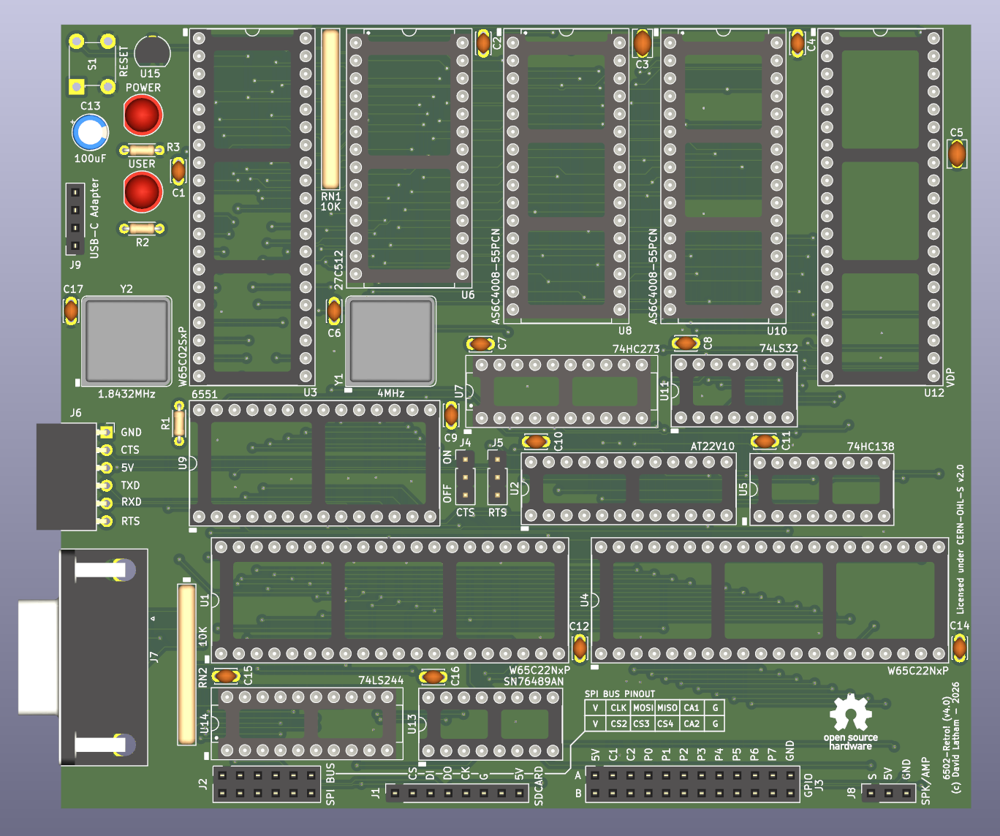

# 6502-Retro! V4

Continuing on from the 6502-Retro-V3-Banked SBC, this board now includes
additional IO in the form of a SPI bus carrying the SDCard interface and 3
additional SPI select lines.  There is also an additional 65C22 VIA with all of
its handshaking and port A and B pins brought out to a pin header.

Another optimization made relates to the RAM and ROM logic.  The RAM Bank is
controlled by the bottom 6 bits of the bank latch with the 7th bit used to
select between two rom banks and the 8th bit used to disable the ROM thus
enabling RAM in its place.

- Schematic: [6502-retro-v4.pdf](./hardware/6502-retro-v4.pdf)

## Memory

### Memory Bank Latch

- MSB of RAM BANK LATCH is ROMSW.
- PLD enables ROM (ROMEN=0) when ROMSW=0.
- PLD disables ROM(ROMEN=1) when ROMSW=1.
- RAM banks are driven by the lower 6bits giving 64 x 8k banks
- ROMSEL (bit 6) selects between the lower and upper 32k of ROM

### Memory Map

| Address | Description                                 |
| ------- | ------------------------------------------- |
| 0x0000  | FIXED RAM START/ ZERO PAGE                  |
| 0x0100  | HW STACK                                    |
| 0x0200  | FIXED USER RAM START                        |
| 0xBEFF  | FIXED USER RAM RAM END                      |
| 0xBF00  | IO- BANK LATCH (MSB=ROMSWITCH) (banks 0-63) |
| 0xBF10  | IO- ACIA/ UART                              |
| 0xBF20  | IO- VIA1 / SPI / Some IO                    |
| 0xBF30  | IO- VIA2 / Peripheral IO                    |
| 0xBF40  | IO- VDP/ TMS9918A Clone                     |
| 0xBF50  | IO- JSEN/ Joy Stick                         |
| 0xBF60  | IO- SNEN/ SN76489                           |
| 0xBFxx  | RESERVED IO / Unused                        |
| 0xC000  | HIGH/ BANKED RAM/ 64 x 8kb banks ram        |
| 0xE000  | ROM/ 8KB ROM                                |
| 0xFFFA  | VECTORS/ HW vectors                         |
| 0xFFFF  | END OF ALL MEMORY                           |

## License

Copyright © 2026 David Latham

This source describes hardware settled by the CERN-OHL-S v2. Licensed under the
CERN-OHL-S v2.0 or later. You may redistribute and modify this source and make
products using it under the terms of the CERN-OHL-S v2.0
[https://ohwr.org/cern_ohl_s_v2.txt](./LICENSE.md).

